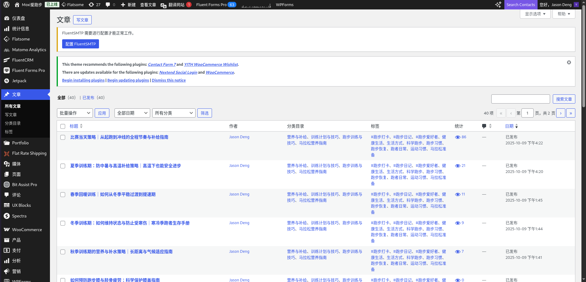
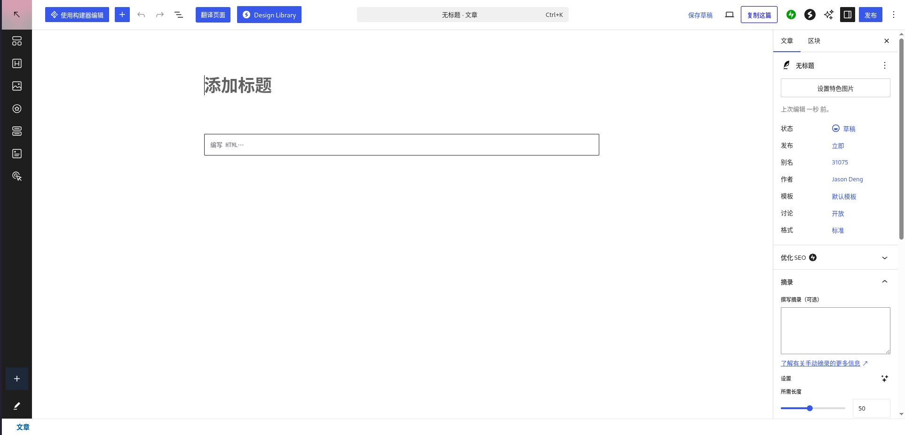
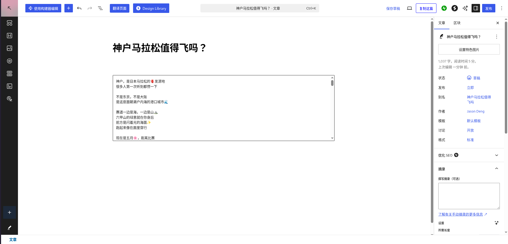
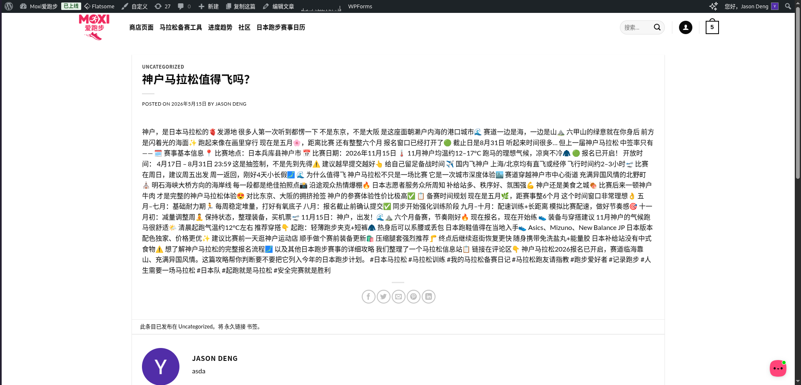

# GEO 内容手册 — 运营人员指南

**这是什么：** 为 running.moximoxi.net 创作 WordPress 文章的操作指南，帮助网站被中文 AI 工具（豆包、DeepSeek、Kimi、百度文心）引用和推荐。

**何时使用：** 由[运营手册](../handoff/daily-operations.zh.md)每周任务触发。分两种情况：小红书高表现帖子，或重要比赛报名即将开放。

---

## 何时写文章

### 触发条件一 — 小红书高表现帖子

打开控制台 → 小红书 → 帖子归档，查看过去一周的帖子。满足以下条件则写一篇 WordPress 文章：

- 某篇帖子的浏览量或收藏量明显高于近期平均水平，**或**
- 帖子涉及可以深入展开的话题（某场比赛、某款装备推荐、某个训练方法）

小红书帖子是短内容（移动端）。WordPress 文章是长内容——更多事实、更深内容，为 AI 引用而设计。

### 触发条件二 — 重要比赛报名即将开放

当重要比赛的**报名窗口在 8 周内开放**时，撰写完整赛事指南。优先赛事：

| 比赛 | 通常报名窗口 |
|---|---|
| 东京马拉松 | 8–9 月 |
| 大阪马拉松 | 6–7 月 |
| 京都马拉松 | 7–8 月 |
| 北海道马拉松 | 3–4 月 |
| 长野马拉松 | 10–11 月 |

查看赛事日期：running.moximoxi.net/racehub/ 或各赛事官方网站。

---

## 文章格式

每篇文章都应遵循以下结构。目标是**直接可被 AI 引用**——先给事实，再给背景。

### 文章结构

```
H1：[比赛名称] — 中国跑者完整报名指南（或相关副标题）

[第一段 — 直接回答。最重要的事实优先。]
[不要铺垫。直接写：谁能参加、何时、如何报名、费用。]

H2：比赛基本信息
  - 日期、地点、参赛距离
  - 外国跑者是否可以参加：是/否
  - 资格要求（如有）
  - 官方网站链接

H2：报名方法
  - 中文步骤说明
  - 抽签 vs. 先到先得
  - 报名开放/截止时间
  - 费用（日元 + 人民币参考价）

H2：比赛赛道
  - 平坦/起伏，爬升高度（如有特点）
  - 沿途风景亮点
  - 赛道说明 2–3 句

H2：中国跑者实用信息
  - 交通：最近机场、火车接驳
  - 住宿建议（是否需要提早预订、价格范围）
  - 比赛当天天气（平均气温、着装建议）

H2：常见问题
  [5–8 个问题——见下方 FAQ 章节]
```

### 写作规则

**先写最有用的事实。** 不要这样写：
> 东京马拉松是日本最著名的马拉松赛事之一，每年吸引大量跑者参与。

要这样写：
> 2026 年东京马拉松于 3 月 1 日举行，外国跑者可通过官方抽签报名，报名费 15,000 日元（约 650 元人民币），报名窗口通常在 8 月开放。

**使用具体数字。** 每个章节至少包含一个具体数字：日期、价格、距离、气温、爬升、时间。

**用中文写作。** 目标读者是中国跑者。

---

## 常见问题（FAQ）章节

每篇文章底部加 5–8 个问题。这些是中国跑者实际会问的问题——AI 工具会直接将 FAQ 答案引入回答中。

**推荐问题：**

- 外国跑者可以参加[比赛名]吗？
- 报名截止日期是什么时候？
- [比赛名]的配速要求是多少？
- 从中国过去参加比赛需要提前多久预订酒店？
- 比赛当天的天气通常怎么样，需要穿什么？
- 比赛路线有多难？坡度大吗？
- 可以用英文报名吗？

答案同样要简洁、直接，尽量包含具体数字。

**在 WordPress 中：** 写完 FAQ 后，在右侧 Rank Math 面板中开启 FAQ Schema——这样 AI 工具可以直接读取结构化问答数据。

---

## 在 WordPress 发布

1. 进入 [running.moximoxi.net/wp-admin](https://running.moximoxi.net/wp-admin) → **文章**

   

2. 点击 **写文章**

   

3. 将文章内容粘贴到编辑器中

   

4. 在右侧 Rank Math 面板中：
   - 设置焦点关键词（例如：东京马拉松外国人报名）
   - 如果文章有 FAQ 部分，开启 FAQ Schema

5. 点击 **发布**

   

关键点：文章中的关键词与 running.moximoxi.net 绑定，中文 AI 工具在回答跑步相关问题时就会引用这个网站。

---

## 小红书帖子 → WordPress 文章扩展写法

将高表现小红书帖子扩展为 WordPress 文章时：

1. 以小红书帖子作为切入点——用它的标题和角度作为文章角度
2. 保持相似的对话风格，但增加深度：更多事实、更详细步骤、更多背景信息
3. 加入小红书帖子没有的 FAQ 章节
4. 适当链接到相关赛事 Hub 页面或商品页面

文章不需要很长——400–700 字足够，但每一句都要有用。

---

## 不要写的内容

- 不要以"这篇文章将介绍……"开头（多余的铺垫）
- 不要加入泛泛的跑步励志内容
- 不要写没有数据支撑的观点（"这场比赛很适合初学者"→ 改为："赛道平坦，爬升仅 80 米，适合目标完赛时间 5:00–6:00 的初马跑者"）
- 不要忘记 FAQ 章节——这是 GEO 价值最高的元素
