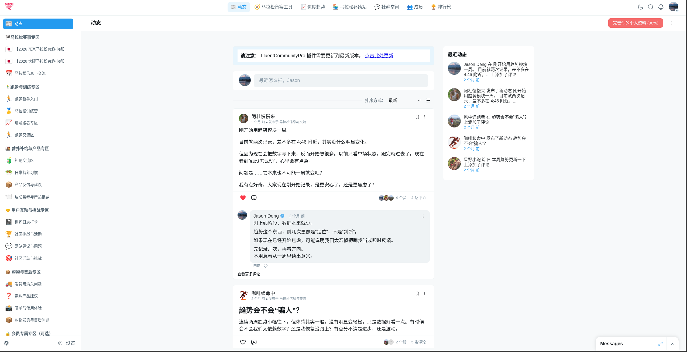
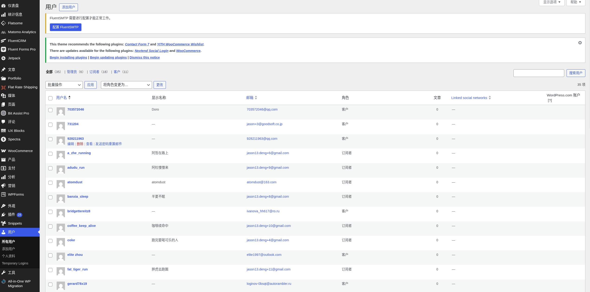
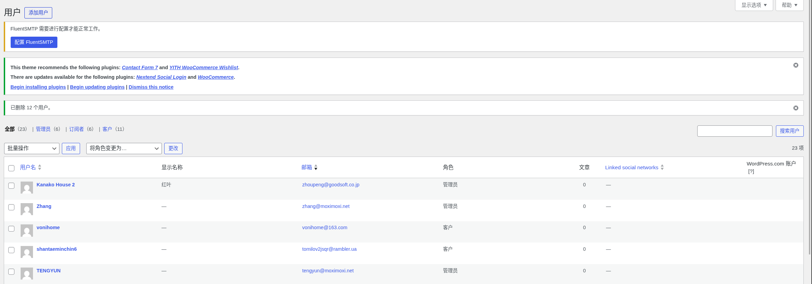
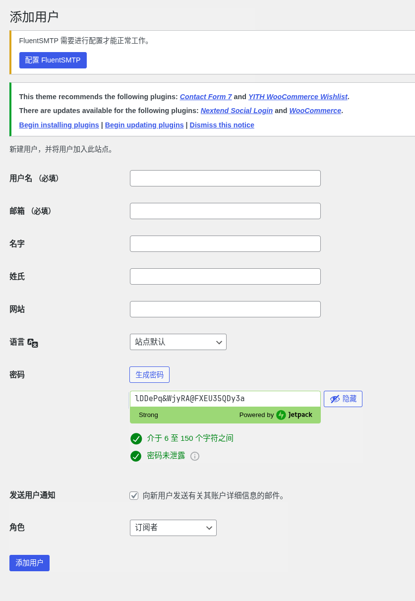

# 社区运营手册

社区平台为 **FluentCommunity**，安装在 WordPress 后台。运营目标是保持社区活跃——定期以不同用户身份发帖、回复，营造真实的讨论氛围。

---

## 目录

- [社区总览](#社区总览)
- [如何以不同用户身份发帖](#如何以不同用户身份发帖)
- [如何创建新社区账号](#如何创建新社区账号)
- [如何发布帖子与回复](#如何发布帖子与回复)
- [如何创建新兴趣小组](#如何创建新兴趣小组)
- [日常运营建议](#日常运营建议)

---

## 社区总览

社区入口：**running.moximoxi.net/community**

社区结构：
- **动态** — 所有频道的综合动态流
- **马拉松备赛工具** — 嵌入式备赛计算工具
- **进度趋势** — 用户配速记录模块
- **马拉松补给站** — 商城入口
- **社群空间** — 按主题划分的讨论频道（见左侧栏）
- **成员 / 排行榜** — GamiPress 积分系统

现有讨论频道包括：
马拉松信息与交流、东京/大阪兴趣小组、跑步新手入门、马拉松训练营、补剂交流区、训练日志打卡、购物发货与售后等。

---

## 如何以不同用户身份发帖

社区已有多个预设账号，用于模拟活跃用户发帖。账号均使用同一邮箱的 **+数字** 后缀格式创建（例如 `jason+1@goodsoft.co.jp`），方便统一管理。

**查看所有账号：**

WordPress 后台 → **用户 → 所有用户**

在这里可以看到所有社区账号及其邮箱。

**以某个账号身份登录发帖：**

1. 用该账号的邮箱 + 密码登录网站前台（密码保存在账户信息表格中）
2. 进入社区，以该用户身份发帖或回复
3. 发帖完成后退出，切换回管理员账号

> **提示：** 浏览器支持多账号配置文件（Profile），可以同时登录多个账号，避免反复切换登录。

---

## 如何创建新社区账号

如需增加新的社区账号（例如为新运营人员创建专属角色账号）：

**入口：** WordPress 后台 → **用户**

点击 **添加用户**

填写以下信息：
- **用户名**：设置一个中文昵称风格的英文 ID（如 `morning_runner`）
- **邮箱**：使用 `你的邮箱+数字@域名` 格式（如 `operator+1@example.com`）
- **密码**：点击"生成密码"，**务必保存到账户信息表格中**
- **角色**：选择 **订阅者**（社区普通成员权限）
- 取消勾选"向新用户发送账户信息邮件"（避免发送到+别名邮箱）

点击 **添加用户** 完成创建。

创建后，在社区前台用该账号登录，补充头像和个人简介，让账号看起来更真实。

---

## 如何发布帖子与回复

**发布新帖：**

1. 用对应账号登录网站前台
2. 进入社区 → 选择对应的**讨论频道**（如"马拉松信息与交流"）
3. 点击发帖框，输入内容，选择频道，点击**发布**

**发帖内容建议：**
- 以跑者视角提问或分享，语气自然，像真实用户
- 可参考现有帖子的风格：分享训练感受、提问比赛细节、讨论装备补给
- 不要每个账号都发同一类内容——保持不同账号有不同"性格"

**回复帖子（以管理员 Jason Deng 身份）：**

1. 用管理员账号登录
2. 找到需要回复的帖子，点击**评论**
3. 输入回复内容，点击发送

管理员回复应简短、有帮助，起到引导讨论的作用。

---

## 如何创建新兴趣小组

当有新的赛事或热点话题时，可以创建对应的兴趣小组（如"2027 东京马拉松兴趣小组"）。

**入口：** WordPress 后台 → **FluentCommunity → Spaces（频道管理）**

1. 点击 **添加新频道**
2. 填写频道名称（加上对应 emoji，如 🏁 2027 东京马拉松兴趣小组）
3. 设置为**社区可见**，允许成员自由加入
4. 保存后在前台社区的左侧栏即可看到

创建后，在管理员账号下发一篇**欢迎帖**，介绍小组用途和参与方式，参考现有兴趣小组的欢迎帖格式。

---

## 日常运营建议

| 频率 | 任务 |
|---|---|
| 每天 | 查看社区动态，回复真实用户留言（以管理员身份） |
| 每周 2–3 次 | 以不同账号身份发帖，保持讨论活跃 |
| 每月 | 根据赛季热点创建新兴趣小组或发起社区挑战 |

**发帖节奏参考：**
- 同一账号不要每天都发，保持自然频率（每周 1–2 次）
- 不同账号轮换发帖，确保动态流看起来多元
- 管理员（Jason Deng）保持"引导者"角色——提问、总结、给出建议，不要过多主导话题

**话题选题参考：**
- 训练中的困惑与焦虑（最容易引发共鸣）
- 日本马拉松赛事资讯与经验分享
- 装备、补给、配速策略讨论
- 比赛前后的心态分享
