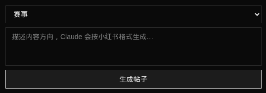
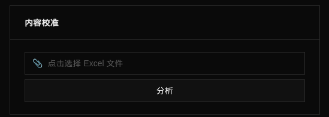
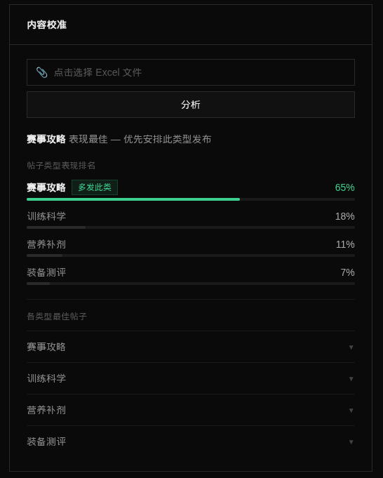

# Dashboard Operations Manual

The dashboard is the operations hub for the entire automation system. No technical knowledge needed — all daily tasks are done from one page.

---

## Contents

- [How to Open the Dashboard](#how-to-open-the-dashboard)
- [Home Page Overview](#home-page-overview)
- [XHS Module](#xhs-module)
  - [Content Calibration](#content-calibration)
- [Rakuten Module](#rakuten-module)
- [Race Scraper Module](#race-scraper-module)

---

## How to Open the Dashboard

Enter the dashboard URL in your browser (see the credentials table).

> Note: this address is private — do not share it.

---

## Home Page Overview

When you open the dashboard, you'll see three status cards — one for each automation system:

| Card | Responsible for |
|---|---|
| **XHS Pipeline** | Generates Xiaohongshu post content daily |
| **Rakuten Aggregator** | Fetches products from Rakuten weekly and lists them in the store |
| **Race Scraper** | Scrapes Japanese race information weekly |

**Every day, open the dashboard and check these three cards first.** Under normal conditions:

- **Last Status** shows "success"
- **Current State** shows "idle" (system is waiting for the next run)

If you see red text or "failed", refer to the relevant module section in this manual.

### Card Metrics Explained

**XHS card:**
- **Last Run** — when the last post was generated
- **Next Post** — the next scheduled post time and type
- **Success Rate (30d)** — the proportion of successful automated runs over the past month
- **Post Types** — how many posts of each type have been generated (race / training / nutrition / wearable)
- **API Tokens** — AI usage volume, for reference

**Rakuten card:**
- **Catalog Size** — number of products in the database
- **WooCommerce Live** — number of products actually visible in the store

**Scraper card:**
- **Total Races** — number of Japanese races currently in the database
- **Next Scrape** — countdown to the next automatic scrape

---

## XHS Module

Click **XHS** in the left menu to open the XHS detail page.

This page is split into two sides:
- **Left** — posting schedule + generate post button
- **Right** — pending posts, post archive, run history

---

### View Pending Posts

The red "**Pending**" section at the top right shows posts that have been generated but not yet manually published to Xiaohongshu.

If you see an "**Overdue**" label, the post's scheduled publish time has passed — handle it promptly.

**How to handle:**
1. Click the post entry to expand its content
2. Copy the title, body, hashtags, etc. and post manually in the Xiaohongshu app
3. After publishing, return to the dashboard and mark the post as published

---

### Generate a New Post

To generate a post immediately (without waiting for the schedule):

1. Select a post type from the dropdown at the top left (Race / Training / Nutrition / Wearable)
2. Click **Generate Post**
3. Wait a few dozen seconds — once done, the post appears in the "Pending" list on the right

---

### Custom Post Content

When you want to generate a post around a specific topic (e.g. registration guide for a particular race, brand gear comparison, seasonal training advice), you can add a custom direction at generation time.

1. Select the post type (this determines which hashtags and comments are used)
2. Write your direction in Chinese in the input box, for example:
   - `围绕大阪马拉松2026，重点讲一下报名流程和注意事项`
   - `写一篇比较佳明和苹果手表的内容，面向准备跑第一场全马的新手`
3. Click **Generate Post**

> **Note:** When you select the "Race" type, Claude automatically references all races in the current database — no need to specify a race manually. If you leave the custom field empty, the system automatically picks an unposted race to generate from.

---

### Edit the Posting Schedule

The "**Schedule**" section on the left shows the daily posting times and types.

**Change a time:**
1. Click the hour or minute field for that day and type the new time
2. Click **Save**

**Change a post type:**
1. Click the coloured label for that day (e.g. "Race", "Training")
2. Select a new type from the dropdown
3. Click **Save**

**Add multiple slots on one day:**
1. Click **+ Add Slot** on the right side of that day
2. Set the time and type
3. Click **Save**

Changes take effect immediately — no restart needed.

---

### Race Cooldown Management

The system records races that have had posts published in the last 7 days, and automatically skips them during generation to avoid repeats.

The "**Race Cooldown**" section on the left shows the current cooldown list. If a race is in cooldown but you want to post about it again, you can reset it manually:

1. Expand the "Race Cooldown" panel
2. Find the relevant race and click **Reset**
3. The race is removed from the cooldown list and can be selected again next time

> The system clears cooldown records automatically after 7 days — manual intervention is rarely needed.

---

### View Post Archive

The "**Post Archive**" on the right records all previously generated posts. Click any entry to expand and view the full content (title, body, hashtags, comments).

---

### View Run History

The "**Run History**" on the right records the result of every system run — success or failure, and the reason for any failure.

If a run failed, you can see exactly which step caused the problem here.

---

### Content Calibration

Once a month, export data from XHS Creator Studio, upload it to the dashboard, and use the analysis to adjust your posting strategy. You can also click **Analyze** without uploading a file — the system will use existing data from the database.

**Step 1: Export data from XHS Creator Studio**

1. Open XHS Creator Studio
2. Click **Content Analytics** at the top

3. Click **Export Data** in the top right

The file downloads to your computer automatically (.xlsx format).

**Step 2: Upload to the dashboard**

1. Open Dashboard → XHS → left panel "**Content Calibration**"
2. Click "Select Excel file (.xlsx)" and choose the downloaded file

3. Click **Analyze** and wait a few seconds

> **Tip:** You can click **Analyze** directly without selecting a file — the system will analyze existing historical data from the database. Useful when you don't want to export a file every time.

**Step 3: Adjust posting strategy based on results**

Results show the performance ranking and suggested weight for each post type. The top-ranked type shows a "**Post More**" label.

Adjust the "**Schedule**" on the left — increase the frequency of high-performing types and reduce low-performing ones.

---

## Rakuten Module

Click **Rakuten** in the left menu to open the Rakuten detail page.

---

### Sync Products Now

Click the **Sync Now** button at the top to immediately fetch the latest products from Rakuten and update the store.

Normally runs automatically every Monday at midnight. Trigger manually when:
- You've manually removed unsuitable products and want to replenish
- You want to update a batch of prices immediately

The sync takes a few minutes — the "Run Log" on the right shows progress in real time.

---

### Edit Pricing Config

The "**Pricing Config**" section controls how products are priced:

| Field | Meaning | Suggested update frequency |
|---|---|---|
| **JPY → CNY Rate** | Exchange rate used to convert product prices | When rate moves more than 2% |
| **Markup %** | Profit margin added on top of cost (currently 30%) | When you need to adjust margins |
| **Search Fill Threshold** | Auto-fetch from Rakuten when results fall below this count | Rarely needed |
| **Products per Category** | Target number of products per category | When you want to increase or reduce catalog size |

After saving, prices recalculate automatically and update in the store.

**Exchange rate reference:** Check the current JPY/CNY rate at xe.com.

---

### View Import Log

The "**Import Log**" on the right records the status of each product listing — success, failure, or skipped.

If a product isn't appearing in the store, check here for the reason. Failed products are retried automatically on the next sync.

---

## Race Scraper Module

Click **Race Scraper** in the left menu to open the scraper detail page.

---

### Run Scraper Now

Click **Run Scraper Now** to immediately fetch the latest Japanese race information.

Normally runs automatically every Sunday at midnight. Trigger manually when:
- You suspect the race data is out of date
- You want to confirm a new race has been added

The scrape takes 5–15 minutes.

---

### View Race List

The "**Races**" section on the right shows all scraped Japanese races currently in the database (name, date, location, registration status).

Click to expand and view details. This data is what the website's race hub page shows to visitors.

---

### View Run History

"**Run History**" records each scrape result — how many races were scraped, any failures, and the URLs that failed.

---

## Troubleshooting Quick Reference

| What you see | What to do |
|---|---|
| Home card "Last Status: failed" | Open the relevant module's run history, find the failure reason; contact tech support if unclear |
| XHS "Pending" has overdue posts | Expand the content and publish manually in the XHS app |
| Rakuten product count significantly dropped | Click "Sync Now" to re-fetch |
| Race list hasn't updated in a long time | Click "Run Scraper Now" |
| Dashboard won't open | Check your internet connection; contact tech support if it still won't load |
