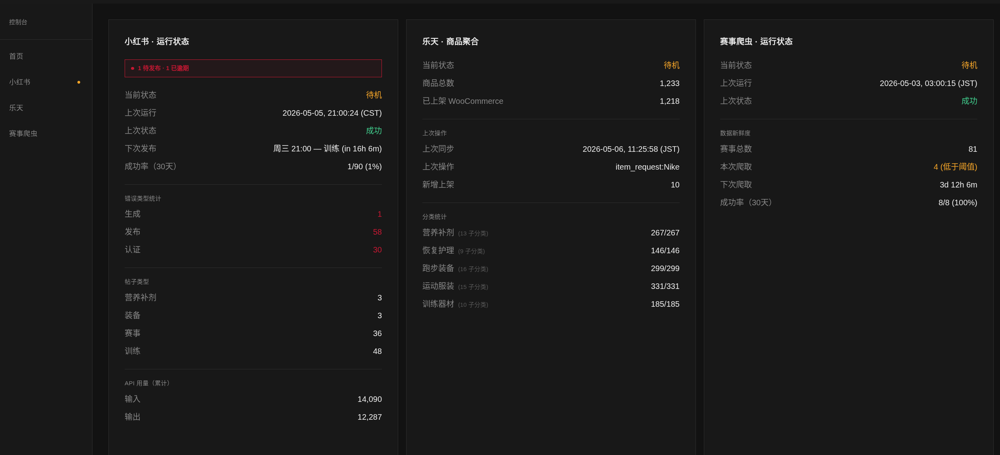
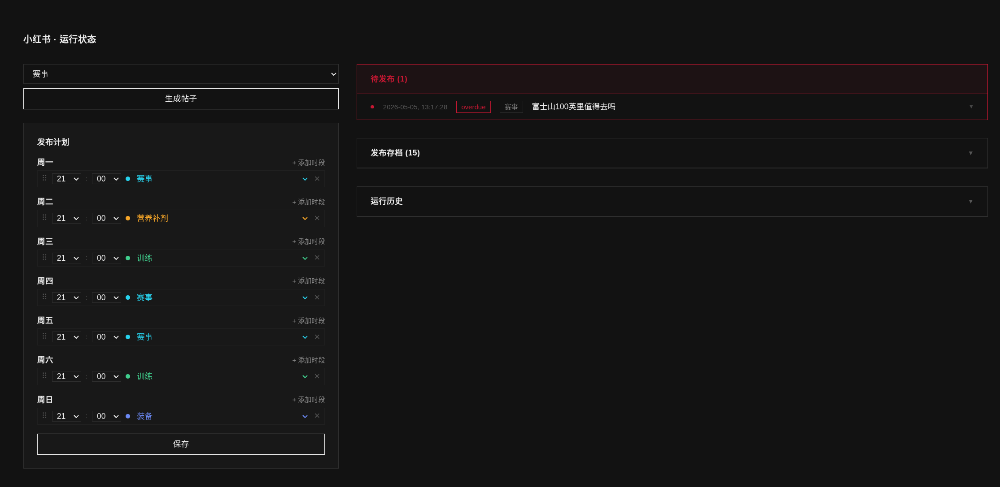
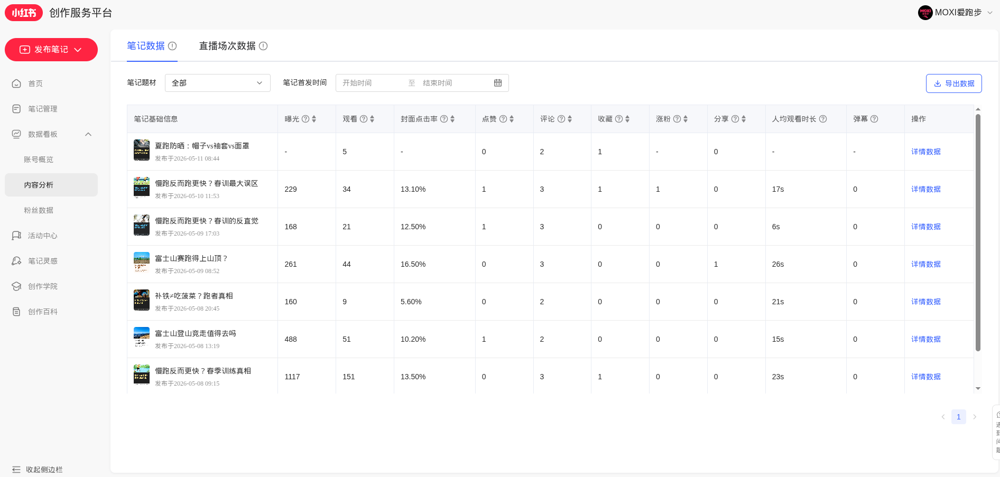
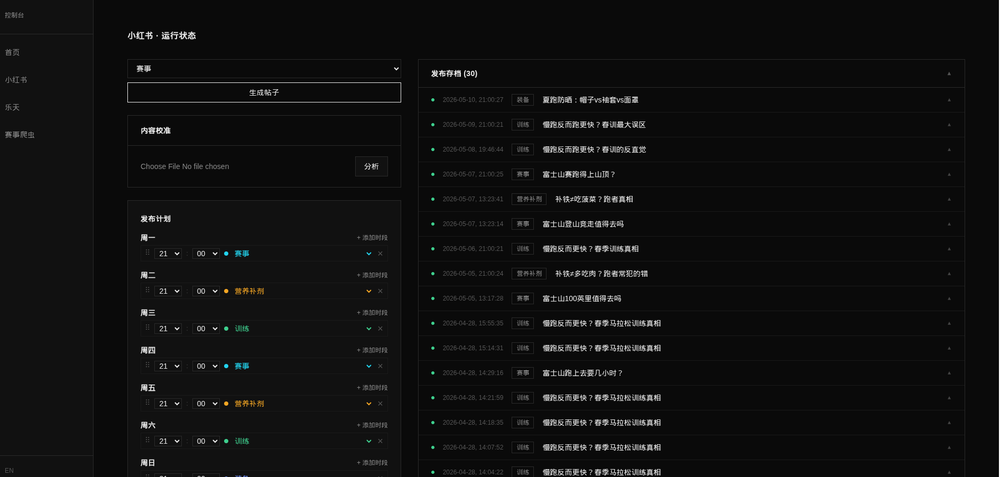
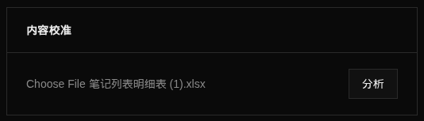
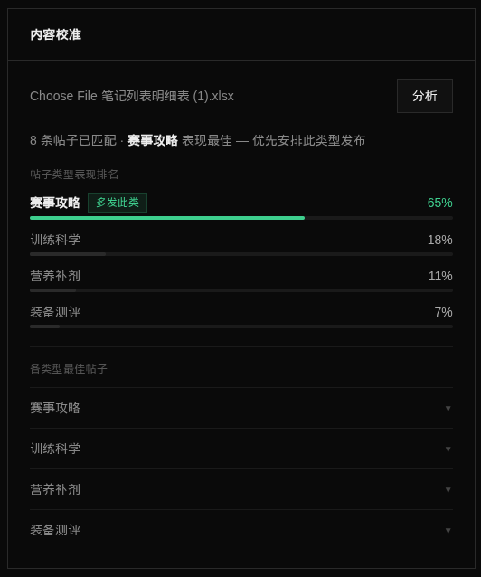
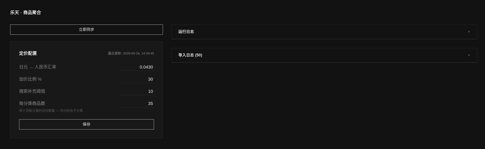
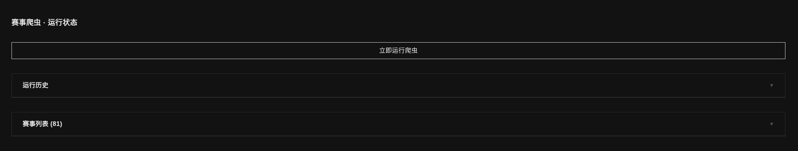

# 控制台操作手册

控制台是整个自动化系统的操作中心。你不需要懂任何技术——所有日常操作都在这一个页面完成。

---

## 目录

- [如何打开控制台](#如何打开控制台)
- [首页总览](#首页总览)
- [小红书模块](#小红书模块)
  - [内容校准](#内容校准)
- [乐天模块](#乐天模块)
- [赛事爬虫模块](#赛事爬虫模块)

---

## 如何打开控制台

在浏览器中输入控制台地址（见账户信息表格）。

> 注意：这个地址是私有的，不要分享给其他人。

---

## 首页总览

打开控制台后，你会看到三张状态卡片，分别对应三个自动化系统：

| 卡片 | 负责什么 |
|---|---|
| **小红书·运行状态** | 每天自动生成小红书帖子内容 |
| **乐天·商品聚合** | 每周自动从乐天抓取商品并上架到网店 |
| **赛事爬虫·运行状态** | 每周自动抓取日本赛事信息 |

**每天打开控制台，先看这三张卡片。** 正常情况下：

- **上次状态** 显示"成功"
- **当前状态** 显示"待机"（表示系统空闲，等待下次运行）

如果看到红色文字或"失败"，参考本手册对应模块的说明。

### 卡片上的数字说明

**小红书卡片：**
- **上次运行** — 上次生成帖子的时间
- **下次发布** — 下一篇帖子计划发布的时间和类型
- **成功率（30天）** — 过去一个月自动运行的成功比例
- **帖子类型** — 各类型帖子的生成数量（赛事/训练/营养补剂/装备）
- **API 用量** — AI 处理量，仅供参考

**乐天卡片：**
- **商品总数** — 数据库中的商品数量
- **已上架 WooCommerce** — 实际在网店可见的商品数量

**赛事爬虫卡片：**
- **赛事总数** — 当前数据库中的日本赛事数量
- **下次爬取** — 下次自动抓取赛事的倒计时

---

## 小红书模块

点击左侧菜单 **小红书**，进入小红书详情页。

这个页面分为左右两侧：
- **左侧** — 发布计划 + 生成帖子按钮
- **右侧** — 待发布帖子、发布存档、运行历史

---

### 查看待发布帖子

右侧顶部红色区域"**待发布**"显示已生成但还没有手动发布到小红书的帖子。

如果看到"**已逾期**"标签，说明这篇帖子的计划发布时间已经过了，需要尽快处理。

**处理方式：**
1. 点击帖子条目展开内容
2. 将标题、正文、标签等内容复制，在手机小红书 App 上手动发帖
3. 发布完成后回到控制台，将该帖子标记为已发布

---

### 生成新帖子

如果需要立刻生成一篇帖子（不等定时计划）：

1. 左侧顶部下拉菜单选择帖子类型（赛事 / 训练 / 营养补剂 / 装备）
2. 点击 **生成帖子**
3. 等待几十秒，生成完成后帖子出现在右侧"待发布"列表

---

### 修改发布计划

左侧"**发布计划**"区域显示每天的发帖时间和类型。

**修改时间：**
1. 点击对应那天的小时或分钟数字框，直接输入新时间
2. 点击 **保存**

**修改帖子类型：**
1. 点击对应那天的颜色标签（如"赛事""训练"）
2. 从下拉菜单选择新类型
3. 点击 **保存**

**一天添加多个发布时段：**
1. 点击那天右侧的 **+ 添加时段**
2. 设置时间和类型
3. 点击 **保存**

修改后立即生效，无需重启系统。

---

### 查看发布存档

右侧"**发布存档**"记录所有已生成的历史帖子。点击任意条目可展开查看完整内容（标题、正文、标签、评论）。

---

### 查看运行历史

右侧"**运行历史**"记录每次系统运行的结果——成功或失败、失败原因等。

如果某次运行失败，在这里可以看到具体是哪个步骤出了问题。

---

### 内容校准

每月从小红书创作者中心导出数据，上传到控制台分析。系统会告诉你哪类帖子表现最好，建议下个月多发哪种类型。

**第一步：从小红书创作者中心导出数据**

1. 打开小红书创作者中心
2. 点击顶部 **内容分析**

3. 点击右上角 **导出数据**

文件会自动下载到你的电脑（格式为 .xlsx）。

**第二步：上传到控制台**

1. 打开控制台 → 小红书 → 左侧"**内容校准**"面板
2. 点击"选择 Excel 文件（.xlsx）"，选择刚才下载的文件

3. 点击 **分析**，等待几秒

**第三步：根据结果调整发帖策略**

结果显示各类型帖子的表现排名和建议权重。排名第一的类型旁边会显示"**多发此类**"标签。

根据结果调整左侧"**发布计划**"——提高表现好的类型的发布频率，减少表现弱的类型。

---

## 乐天模块

点击左侧菜单 **乐天**，进入乐天详情页。

---

### 立即同步商品

点击顶部 **立即同步** 按钮，系统会立刻从乐天抓取最新商品并更新网店。

正常情况下每周一凌晨自动运行，手动触发适用于：
- 手动下架了不合适的商品后，需要补充新商品
- 想立刻更新一批最新价格

同步过程需要几分钟，期间右侧"运行日志"会实时显示进度。

---

### 修改定价配置

"**定价配置**"区域控制商品的定价规则：

| 字段 | 含义 | 建议操作频率 |
|---|---|---|
| **日元 → 人民币汇率** | 商品价格换算的汇率基准 | 汇率波动超过 2% 时更新 |
| **加价比例 %** | 在成本价上加多少利润（当前 30%） | 需要调整利润时修改 |
| **搜索补充阈值** | 搜索结果少于多少条时自动从乐天补充 | 一般不需要动 |
| **每分类商品数** | 每个品类目标保持多少商品 | 想增减商品数量时修改 |

修改后点击 **保存**，价格会自动重新计算并更新到网店。

**汇率参考：** 可在 xe.com 查询当前日元对人民币汇率。

---

### 查看导入日志

右侧"**导入日志**"记录每个商品的上架情况——成功、失败或跳过。

如果某个商品没有出现在网店，在这里可以查看原因。失败的商品会在下次同步时自动重试。

---

## 赛事爬虫模块

点击左侧菜单 **赛事爬虫**，进入赛事爬虫详情页。

---

### 立即运行爬虫

点击 **立即运行爬虫**，系统会立刻抓取最新的日本赛事信息。

正常情况下每周日凌晨自动运行。手动触发适用于：
- 怀疑赛事数据过期
- 想确认某场新比赛是否已录入

抓取过程需要 5–15 分钟。

---

### 查看赛事列表

右侧"**赛事列表**"显示当前数据库中所有已抓取的日本赛事（名称、日期、地点、报名状态）。

点击展开可查看详情。这里的数据就是网站赛事页面展示给用户的内容。

---

### 查看运行历史

"**运行历史**"记录每次爬取的结果——抓到多少场赛事、是否有失败、失败的比赛链接。

---

## 常见情况处理

| 看到什么 | 怎么做 |
|---|---|
| 首页卡片"上次状态：失败" | 进入对应模块查看运行历史，找失败原因；如看不懂联系技术支持 |
| 小红书"待发布"有逾期帖子 | 展开内容，手动发布到小红书 App |
| 乐天商品数量明显减少 | 点击"立即同步"重新抓取 |
| 赛事列表长时间没更新 | 点击"立即运行爬虫" |
| 控制台打不开 | 检查网络连接；如仍无法访问联系技术支持 |
