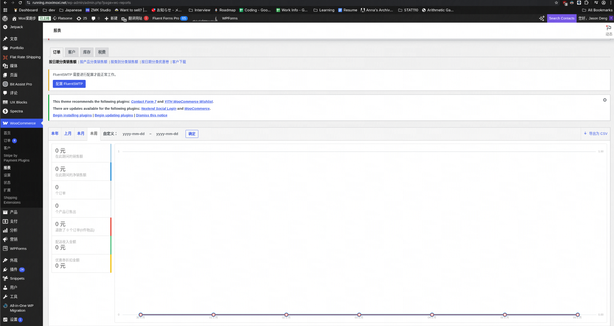
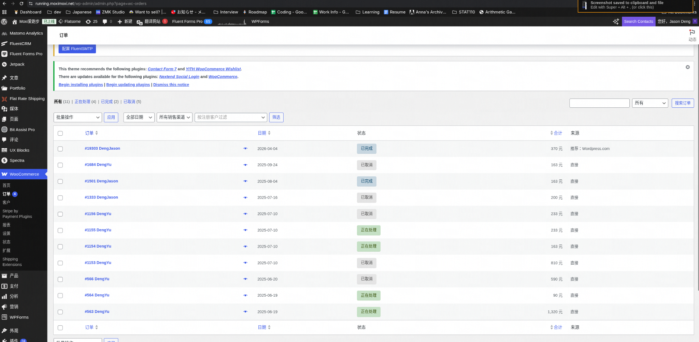
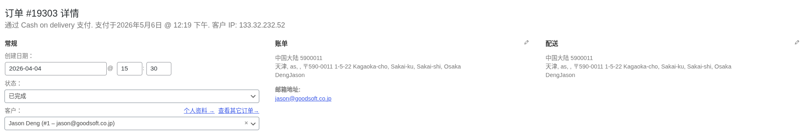
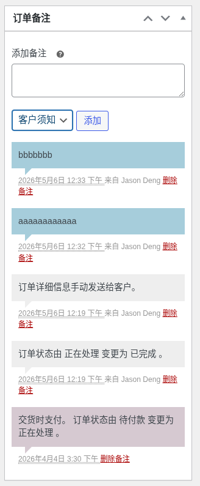
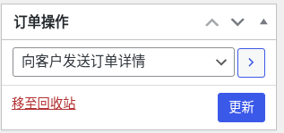
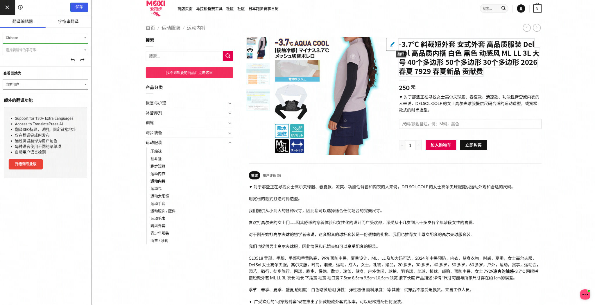
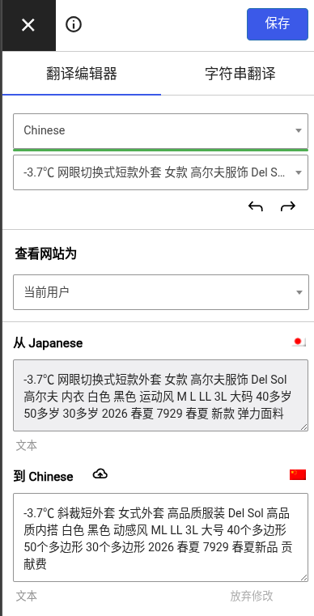

# WordPress 操作手册

---

## 目录

- [如何将订单导出为 Excel](#如何将订单导出为-excel)
- [查看订单详情](#查看订单详情)
- [发送订单消息给客户](#发送订单消息给客户)
- [更新订单状态](#更新订单状态)
- [如何修改翻译](#如何修改翻译)

---

## 如何将订单导出为 Excel

1. 进入 **WooCommerce → 报表**
2. 选择时间范围
3. 点击 **导出为 CSV** 下载

---

## 查看订单详情

1. 进入 **WooCommerce → 订单**

2. 点击任意订单查看详情

---

## 发送订单消息给客户

1. 在订单页面右侧找到 **订单备注** 区域
2. 输入消息内容
3. 下拉菜单选择 **客户须知**
4. 点击 **添加**

---

## 更新订单状态

1. 在订单详情页顶部修改 **状态** 字段（如：已完成）
2. 找到右侧 **订单操作** 区域
3. 下拉菜单选择 **向客户发送订单详情**
4. 点击 **更新**

---

## 如何修改翻译

1. 进入对应商品页面

2. 将鼠标悬停在需要修改的文字上，点击出现的 **编辑页面** 按钮

3. 在翻译编辑器中修改 **到 Chinese** 一栏的内容，完成后点击 **保存**

